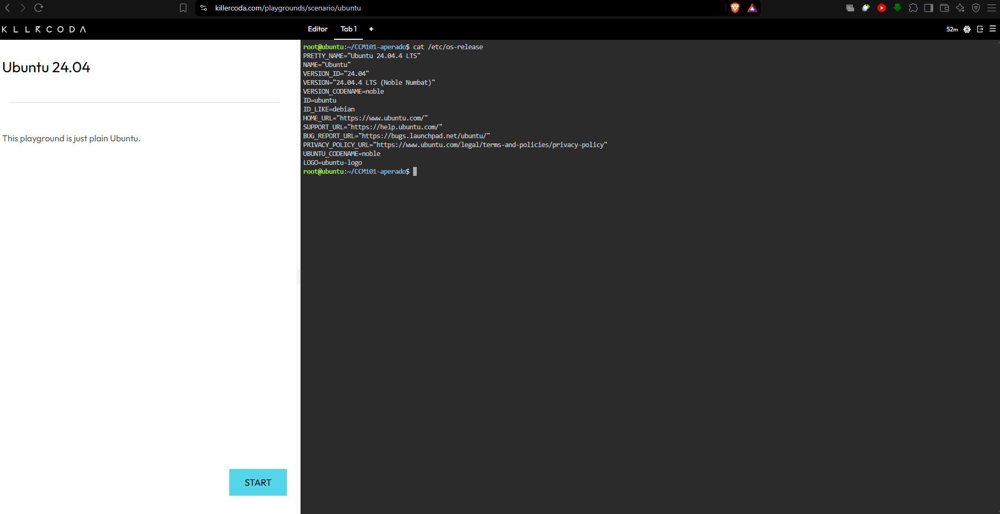
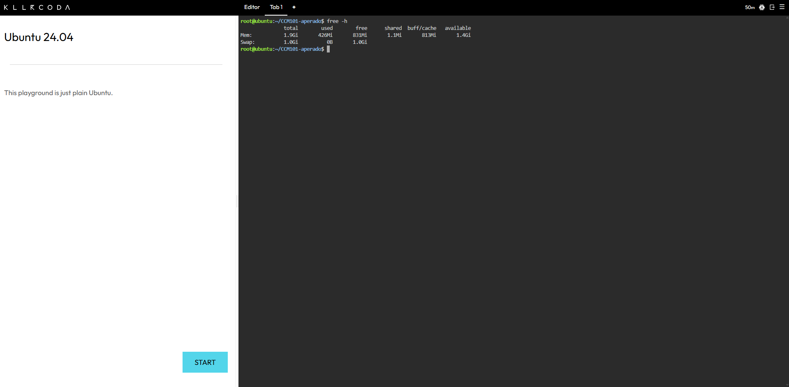
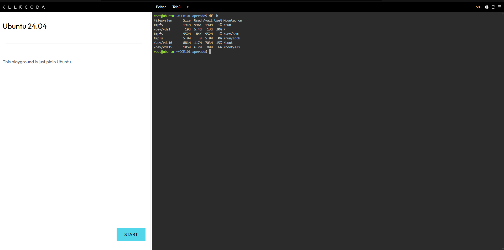

# ☁️ Continue Your Linux Investigation

This document presents the investigation of a Linux server using the KillerCoda Playground. It covers basic system information, cloud migration options, and equivalent virtual machine services from AWS, Microsoft Azure, and Google Cloud Platform.

---

# 1. Linux Server Investigation

The following Linux commands were used in the KillerCoda Playground to identify the basic information of the Linux server.

| **Information** | **Linux Command** | **Command Meaning** |
|---|---|---|
| **Operating System** | `cat /etc/os-release` | Displays information about the installed Linux operating system, including its name, version, and distribution details. |
| **CPU Information** | `lscpu` | Displays detailed information about the CPU, such as architecture, number of CPUs, cores, and threads. |
| **Memory** | `free -h` | Displays the total, used, free, and available RAM. The `-h` option makes the values easier to read. |
| **Disk Space** | `df -h` | Displays the available and used disk space of the file systems. The `-h` option presents the values in a human-readable format. |

---

# 2. Commands and Results

## Operating System

### Command

    cat /etc/os-release

### Meaning

The `cat /etc/os-release` command displays information about the Linux operating system installed on the server. It can show the operating system name, version, ID, and other distribution details.

### Result

---

## CPU Information

### Command

    lscpu

### Meaning

The `lscpu` command displays detailed information about the server's CPU. It can show the CPU architecture, number of CPUs, cores, threads, and other processor information.

### Result

---

## Memory

### Command

    free -h

### Meaning

The `free -h` command displays information about the server's memory usage. It shows the total, used, free, shared, and available RAM.

The `-h` option means **human-readable**, so the memory values are displayed using easier-to-understand units such as MB or GB.

### Result

---

## Disk Space

### Command

    df -h

### Meaning

The `df -h` command displays information about disk space. It shows the total size, used space, available space, and percentage of disk space being used.

The `-h` option means **human-readable**, making the storage values easier to understand.

### Result

---

# 3. Cloud Migration

If this Linux server were migrated to the cloud, it could be hosted using virtual machine services from AWS, Microsoft Azure, or Google Cloud Platform.

| **Cloud Platform** | **Cloud Service** | **Purpose** |
|---|---|---|
| **AWS** | Amazon EC2 | Runs Linux virtual machines using AWS cloud infrastructure. |
| **Microsoft Azure** | Azure Virtual Machines | Runs Linux virtual machines using Microsoft Azure infrastructure. |
| **Google Cloud Platform** | Google Compute Engine | Runs Linux virtual machines using Google Cloud infrastructure. |

These cloud services allow organizations to run Linux servers without maintaining the physical hardware themselves. They also provide flexible computing resources that can be adjusted according to workload requirements.

---

# 4. Cloud Services

## AWS – Amazon EC2

**Amazon EC2 (Elastic Compute Cloud)** can host the Linux server as a virtual machine in AWS. It allows an organization to select computing resources such as CPU, memory, storage, and networking according to the server's requirements.

EC2 provides scalable computing capacity and can be used to deploy Linux-based applications and services in the cloud.

---

## Microsoft Azure – Azure Virtual Machines

**Azure Virtual Machines** can run the Linux server using Microsoft's cloud infrastructure. Azure supports different Linux distributions and allows organizations to select the required CPU, memory, storage, networking, and other resources.

This service provides a flexible way to migrate existing Linux workloads into the Azure cloud environment.

---

## Google Cloud – Google Compute Engine

**Google Compute Engine** can host the Linux server as a virtual machine using Google Cloud infrastructure. It allows organizations to configure the machine's CPU, memory, storage, and networking resources based on the workload.

Compute Engine can be used for running Linux applications and other server-based workloads in the cloud.

---

# 5. Cloud Platform Comparison

The three major cloud providers offer similar virtual machine capabilities for hosting Linux servers.

| **Requirement** | **AWS** | **Microsoft Azure** | **Google Cloud** |
|---|---|---|---|
| **Linux Virtual Machine** | Amazon EC2 | Azure Virtual Machines | Google Compute Engine |
| **CPU Resources** | Configurable | Configurable | Configurable |
| **Memory** | Configurable | Configurable | Configurable |
| **Storage** | Amazon EBS | Azure Managed Disks | Persistent Disk |
| **Scalability** | Yes | Yes | Yes |

### Comparison Summary

All three cloud platforms can support Linux-based workloads and provide configurable computing resources.

- **AWS** uses **Amazon EC2** for virtual machines and **Amazon EBS** for block storage.
- **Microsoft Azure** uses **Azure Virtual Machines** and **Azure Managed Disks**.
- **Google Cloud** uses **Google Compute Engine** and **Persistent Disk**.

The best platform depends on factors such as existing infrastructure, required services, pricing, scalability, and the organization's overall cloud strategy.

---

# 6. Conclusion

The Linux server can be migrated to any of the three major cloud platforms.

**AWS** can host the server using **Amazon EC2**, **Microsoft Azure** can use **Azure Virtual Machines**, and **Google Cloud Platform** can use **Google Compute Engine**.

These services allow organizations to run Linux servers in the cloud while providing flexible computing, memory, storage, networking, and scaling options.

The investigation demonstrates that a Linux server running in a local or learning environment can be transferred to a cloud infrastructure using virtual machine services.

---

# 7. Terminal Screenshots

The following screenshots document the Linux server investigation performed in the KillerCoda Playground.

## Operating System

The `cat /etc/os-release` command was used to identify the Linux distribution and operating system version.

---

## CPU Information

The `lscpu` command was used to examine the server's CPU architecture, processor configuration, cores, and threads.

---

## Memory

The `free -h` command was used to check the server's memory usage, including total, used, free, and available RAM.

---

## Disk Space

The `df -h` command was used to examine the server's available and used disk space.

---

# 📌 Final Summary

This Linux investigation demonstrated how basic server information can be collected using standard Linux commands. The commands `cat /etc/os-release`, `lscpu`, `free -h`, and `df -h` provided information about the operating system, CPU, memory, and disk storage.

The investigation also showed that the Linux server can be migrated to major cloud platforms such as **AWS, Microsoft Azure, and Google Cloud Platform**. Their virtual machine services—**Amazon EC2, Azure Virtual Machines, and Google Compute Engine**—provide configurable computing resources and scalability for Linux workloads.

Understanding these services is important when planning cloud migration because organizations can select a cloud platform based on their technical requirements, existing infrastructure, budget, scalability needs, and long-term goals.
