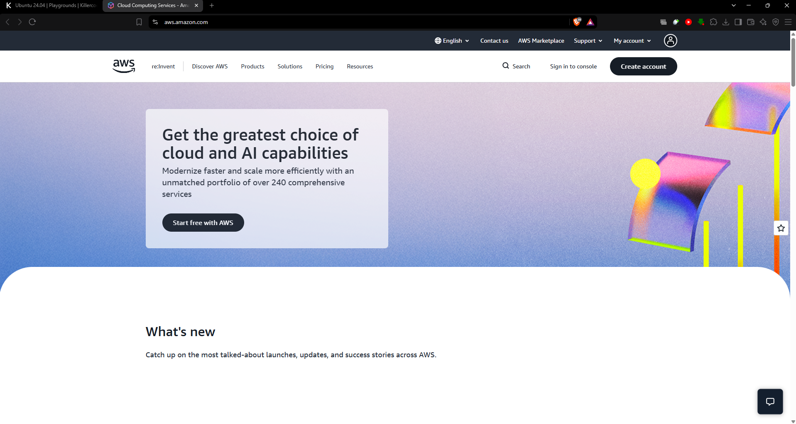

# ☁️ AWS Research

Amazon Web Services (AWS) is one of the leading cloud computing platforms, offering a wide range of services for computing, storage, databases, networking, security, analytics, and application development. It enables organizations to access cloud resources on demand without needing to purchase and maintain extensive physical infrastructure (Amazon Web Services [AWS], n.d.).

---

## 🌎 1. Brief Overview

AWS provides organizations with flexible and scalable cloud resources that can be used to build, deploy, and manage applications and services. Instead of relying entirely on physical servers and data centers, organizations can use AWS infrastructure according to their specific requirements.

### Key Areas of AWS

| Area | Description |
|---|---|
| 💻 Computing | Provides virtual servers and computing resources |
| 💾 Storage | Stores files, applications, backups, and large datasets |
| 🗄️ Databases | Provides managed database services |
| 🌐 Networking | Connects and manages cloud resources |
| 🔐 Security | Provides identity, access control, and security services |
| 📊 Analytics | Supports data processing and analysis |
| 🤖 Application Development | Provides tools for building and deploying applications |

---

## 🌍 2. Global Infrastructure

AWS operates a worldwide cloud infrastructure organized into **Regions** and **Availability Zones (AZs)**.

- **Regions** – Geographically separate areas where AWS provides cloud services.
- **Availability Zones (AZs)** – Isolated locations within an AWS Region designed to provide greater availability and reliability.
- **Local Zones** – Infrastructure placed closer to end users for applications requiring low latency.
- **Wavelength Zones** – Designed to support applications that require very low latency through telecommunications networks.
- **AWS Outposts** – Extends AWS infrastructure and services to on-premises environments.

The use of multiple Availability Zones within a Region helps organizations design applications that remain available even when a particular location experiences an issue (AWS, 2026a, 2026b).

---

## 🖥️ 3. AWS Management Console

The **AWS Management Console** is a web-based interface used to access and manage AWS services. It provides users with a centralized location for configuring cloud resources and monitoring their AWS environment.

### Main Functions

- Create and manage AWS resources
- Configure cloud services
- Monitor resources and service health
- Manage users and permissions
- View billing and usage information
- Select and manage AWS Regions
- Access different AWS cloud services

The console makes it easier for users to interact with AWS services without relying entirely on command-line tools (AWS, 2026c).

---

## ☁️ 4. Four Core AWS Services

### 💻 4.1 Amazon EC2

**Amazon Elastic Compute Cloud (EC2)** provides resizable virtual servers in the AWS Cloud. Organizations can use EC2 instances to host websites, applications, enterprise systems, and other computing workloads.

**Primary purpose:** Virtual computing and server hosting.

---

### 💾 4.2 Amazon S3

**Amazon Simple Storage Service (S3)** is an object storage service designed to store and retrieve different types of data. It can be used for websites, mobile applications, backups, archives, data lakes, and enterprise data.

**Primary purpose:** Cloud-based object storage.

---

### 🗄️ 4.3 Amazon RDS

**Amazon Relational Database Service (RDS)** is a managed database service that simplifies the process of setting up, operating, and scaling relational databases in the cloud.

**Primary purpose:** Managed relational databases.

---

### ⚡ 4.4 AWS Lambda

**AWS Lambda** is a serverless computing service that allows users to run code without directly managing servers. AWS automatically manages the underlying infrastructure and can scale resources according to workload requirements.

**Primary purpose:** Serverless application execution.

---

## 🚀 5. Three Major Advantages of AWS

### 1. 📈 Scalability

AWS allows organizations to increase or decrease cloud resources according to workload requirements. This makes it possible to handle changes in traffic and application demand.

### 2. 🌎 Global Reach

AWS operates infrastructure across multiple geographic Regions and Availability Zones. This allows organizations to deploy applications closer to their users and design systems with improved availability.

### 3. 🧩 Large Service Ecosystem

AWS provides a broad collection of cloud services covering computing, storage, databases, networking, security, analytics, artificial intelligence, and application development.

---

## 🏢 6. Typical Enterprise Use Cases

AWS can be used by organizations for a wide variety of business and technology requirements.

### Common Applications

- 🌐 **Website and Web Application Hosting**  
  Hosting business websites, online services, and web applications.

- 💾 **Data Storage and Backup**  
  Storing company files, backups, archives, and large datasets.

- 🗄️ **Database Management**  
  Running relational databases for business applications.

- ⚡ **Serverless Applications**  
  Developing event-driven applications without directly managing servers.

- 🛡️ **Disaster Recovery**  
  Creating backup environments and recovery solutions for critical systems.

- 📊 **Data Analytics**  
  Processing and analyzing large amounts of organizational data.

- 🤖 **Machine Learning and AI**  
  Developing and deploying intelligent applications and machine learning workloads.

- 🔄 **Application Modernization**  
  Moving traditional applications and infrastructure into modern cloud environments.

---

## 📸 7. AWS Management Console Screenshot

The following screenshot shows the AWS Management Console used during the laboratory activity.

---

## 📚 References

Amazon Web Services. (n.d.). *Amazon EC2*. Retrieved September 10, 2026, from https://aws.amazon.com/ec2/

Amazon Web Services. (n.d.). *Amazon RDS*. Retrieved September 10, 2026, from https://aws.amazon.com/rds/

Amazon Web Services. (n.d.). *AWS Lambda*. Retrieved September 10, 2026, from https://aws.amazon.com/lambda/

Amazon Web Services. (n.d.). *Amazon S3*. Retrieved September 10, 2026, from https://aws.amazon.com/s3/

Amazon Web Services. (2026a). *AWS availability zones*. Retrieved September 10, 2026, from https://docs.aws.amazon.com/global-infrastructure/latest/regions/aws-availability-zones.html

Amazon Web Services. (2026b). *AWS regions*. Retrieved September 10, 2026, from https://docs.aws.amazon.com/global-infrastructure/latest/regions/aws-regions.html

Amazon Web Services. (2026c). *What is the AWS Management Console?* Retrieved September 10, 2026, from https://docs.aws.amazon.com/awsconsolehelpdocs/latest/gsg/what-is.html
