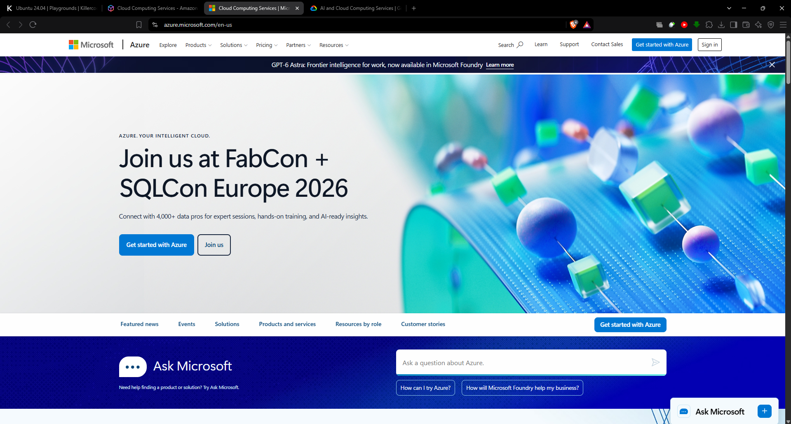

# 🔷 Microsoft Azure Research

Microsoft Azure is one of the leading cloud computing platforms, offering a wide range of services for organizations, developers, and businesses.

---

## 📌 1. Brief Overview

Microsoft Azure is Microsoft's cloud computing platform that provides a wide range of cloud-based services, including computing, storage, databases, networking, analytics, artificial intelligence, containers, security, and application development.

Azure enables organizations to build, deploy, and manage applications and IT infrastructure without having to maintain all of the physical hardware themselves. Its services can support small applications as well as large-scale enterprise systems (Microsoft, n.d.).

---

## 🌍 2. Global Infrastructure

Microsoft Azure operates through a global infrastructure consisting of **geographic regions, datacenters, and Availability Zones**.

An Azure **Region** is a geographic location containing one or more datacenters. Azure organizes regions into **geographies**, which help organizations meet requirements related to data residency, compliance, availability, and network latency.

Azure also provides **Availability Zones**, which are physically and logically separated datacenters within an Azure region. Each zone has independent power, cooling, and networking. Using multiple Availability Zones can help improve the availability and resilience of applications (Microsoft, 2026a, 2026b, 2026c).

> **Key Infrastructure Components**
>
> - 🌎 Azure Regions
> - 🏢 Datacenters
> - 🔄 Availability Zones
> - 🗺️ Azure Geographies
> - ⚡ Low-latency networking

---

## 🖥️ 3. Cloud Management Console

The **Azure portal** is Microsoft's web-based management interface for Azure resources.

Through the portal, users can create, configure, monitor, and manage cloud resources such as virtual machines, databases, applications, storage accounts, and subscriptions. The portal also provides dashboards, search tools, monitoring features, and cost-management capabilities (Microsoft, 2026d).

The Azure portal provides a centralized graphical interface that makes it easier for users to manage their cloud infrastructure.

---

## ☁️ 4. Four Core Azure Services

### 4.1 Azure Virtual Machines

**Azure Virtual Machines (VMs)** provide scalable virtualized computing resources in the cloud.

Users can deploy Windows or Linux virtual machines for different workloads, including websites, business applications, databases, development environments, and high-performance computing (Microsoft, n.d.-a).

**Common Uses:**
- Web servers
- Application servers
- Database workloads
- Development and testing
- High-performance computing

---

### 4.2 Azure Blob Storage

**Azure Blob Storage** is Microsoft's object storage service designed to store large amounts of unstructured data.

It can store different types of data, including documents, images, videos, backups, logs, and application data (Microsoft, n.d.-b).

**Common Uses:**
- 📁 File and document storage
- 🖼️ Image and video storage
- 💾 Backup and archival
- 📊 Large datasets
- 🌐 Application data

---

### 4.3 Azure SQL Database

**Azure SQL Database** is a fully managed relational database service based on Microsoft's SQL Server database engine.

Microsoft manages many database administration tasks, including infrastructure maintenance, patching, backups, monitoring, and availability. This allows organizations to focus more on their applications and data rather than managing database infrastructure (Microsoft, n.d.-c).

**Common Uses:**
- Business applications
- Web applications
- Transaction processing
- Data management
- Enterprise databases

---

### 4.4 Azure Functions

**Azure Functions** is a serverless computing service that allows developers to execute code in response to events without directly managing servers.

It can be used for APIs, automation, background processing, scheduled tasks, and event-driven applications (Microsoft, n.d.-d).

**Common Uses:**
- ⚙️ Automation
- 🔗 APIs
- 📩 Event processing
- ⏱️ Scheduled tasks
- 🔄 Background operations

---

## ⭐ 5. Three Major Advantages

### 1. Strong Enterprise Integration

Azure integrates closely with Microsoft's enterprise technologies and services, making it suitable for organizations that already use products such as Windows Server, Microsoft SQL Server, and other Microsoft technologies.

### 2. Global Infrastructure

Azure's worldwide network of regions and datacenters allows organizations to deploy applications closer to their users. This can help improve availability, performance, and compliance with data residency requirements.

### 3. Managed Cloud Services

Azure provides many managed services, such as Azure SQL Database and Azure Functions. These services reduce the amount of infrastructure administration required from organizations and development teams.

---

## 🏢 6. Typical Enterprise Use Cases

Microsoft Azure can be used for many types of enterprise workloads, including:

- 🌐 Hosting Windows and Linux web applications
- ☁️ Migrating existing IT infrastructure to the cloud
- 🗄️ Managing relational and enterprise databases
- 🔗 Developing APIs and serverless applications
- 📦 Deploying containerized applications
- 📊 Data analytics and business intelligence
- 🤖 Artificial intelligence and machine learning
- 💾 Backup and disaster recovery
- 🔄 Hybrid cloud environments
- 🏢 Microsoft enterprise application integration

---

## 📸 Azure Management Console

*Figure 1. Azure Management Console*

The screenshot above shows the Azure management environment explored during the laboratory activity.

---

# 📚 References

Microsoft. (n.d.). *Azure Blob Storage*. Retrieved September 10, 2026, from  
https://azure.microsoft.com/en-us/products/storage/blobs/

Microsoft. (n.d.). *Azure Functions*. Retrieved September 10, 2026, from  
https://azure.microsoft.com/en-us/products/functions/

Microsoft. (n.d.). *Azure SQL Database*. Retrieved September 10, 2026, from  
https://azure.microsoft.com/en-us/products/azure-sql/database

Microsoft. (n.d.). *Azure Virtual Machines*. Retrieved September 10, 2026, from  
https://azure.microsoft.com/en-us/products/virtual-machines

Microsoft. (2026a). *Azure global infrastructure*. Retrieved September 10, 2026, from  
https://azure.microsoft.com/en-us/explore/global-infrastructure

Microsoft. (2026b). *Azure geographies*. Retrieved September 10, 2026, from  
https://azure.microsoft.com/en-us/explore/global-infrastructure/geographies

Microsoft. (2026c). *Azure availability zones*. Retrieved September 10, 2026, from  
https://azure.microsoft.com/en-us/explore/global-infrastructure/availability-zones/

Microsoft. (2026d). *What is the Azure portal?* Microsoft Learn. Retrieved September 10, 2026, from  
https://learn.microsoft.com/en-us/azure/azure-portal/azure-portal-overview
