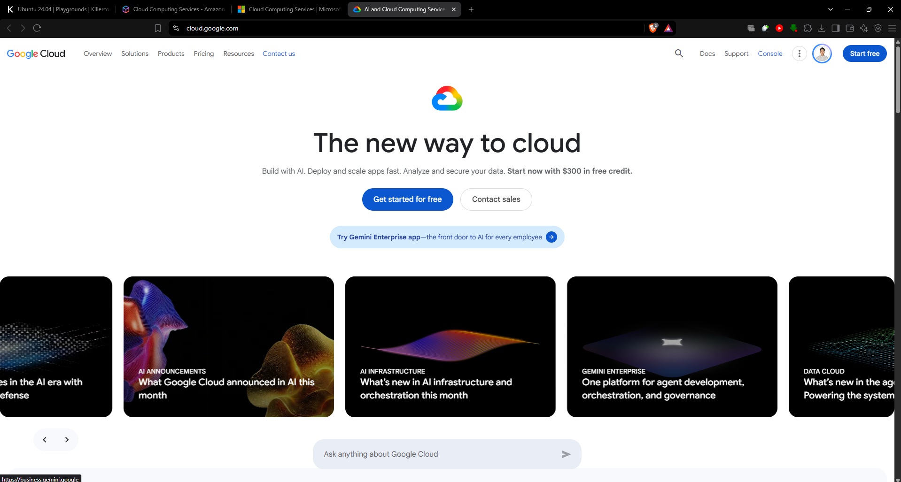

# 🌐 Google Cloud Platform (GCP) Research

Google Cloud Platform (GCP), commonly known as **Google Cloud**, is a cloud computing platform that provides scalable services for organizations, developers, and businesses.

---

## 📌 1. Brief Overview

Google Cloud is Google's cloud computing platform that provides a wide range of services for computing, storage, databases, networking, data analytics, containers, application development, and artificial intelligence.

It allows organizations to build, deploy, and manage applications while using Google's global cloud infrastructure. Businesses can also store, process, and analyze data without having to maintain all of their own physical servers and infrastructure (Google Cloud, n.d.).

---

## 🌍 2. Global Infrastructure

Google Cloud's infrastructure is organized into **Regions and Zones**.

A **Region** is a specific geographic location where Google Cloud infrastructure is available, while a **Zone** is an independent deployment area within a region. Using multiple zones can help organizations design applications with improved availability and resilience.

Google Cloud also supports **global, regional, and multi-region resources**, allowing services and applications to be deployed according to performance, availability, and location requirements.

Its global network is designed to provide high-performance connectivity and help deliver low-latency access to cloud services and applications around the world (Google Cloud, 2026a, 2026b).

> **Key Infrastructure Components**
>
> - 🌎 Cloud Regions
> - 🏢 Cloud Zones
> - 🌐 Global Resources
> - 🔄 Multi-Region Resources
> - ⚡ Global Network Infrastructure

---

## 🖥️ 3. Cloud Management Console

The **Google Cloud Console** is a browser-based management interface used to access and manage Google Cloud resources.

Through the console, users can manage projects, cloud services, virtual machines, storage, databases, billing information, and account activity. It also provides access to tools such as **Cloud Shell**, which allows users to perform cloud management tasks using a command-line environment.

In addition to the web console, Google Cloud resources can also be managed through the **Google Cloud CLI** and **REST APIs** (Google Cloud, 2026c).

---

## ☁️ 4. Four Core GCP Services

### 4.1 Compute Engine

**Compute Engine** is Google Cloud's Infrastructure-as-a-Service (IaaS) offering that provides virtual machines and other computing resources on Google's infrastructure.

It allows users to run customizable workloads without managing their own physical servers.

**Common Uses:**
- 🌐 Web servers
- 💼 Business applications
- 🗄️ Database workloads
- 🧪 Development and testing environments
- ⚙️ Custom computing workloads

---

### 4.2 Cloud Storage

**Cloud Storage** is a managed object storage service used for storing unstructured data in cloud-based storage buckets.

It can securely store and retrieve different types of data, including files, backups, media, application data, and large datasets (Google Cloud, n.d.-b).

**Common Uses:**
- 📁 File storage
- 💾 Backup and archival
- 🖼️ Image and media storage
- 📊 Analytics datasets
- 🌐 Content distribution

---

### 4.3 Cloud SQL

**Cloud SQL** is a fully managed relational database service that supports **MySQL, PostgreSQL, and SQL Server**.

Google Cloud manages many administrative tasks, including backups, replication, patching, encryption, and storage capacity. This allows organizations to focus more on managing their applications and data rather than maintaining database infrastructure (Google Cloud, n.d.-c).

**Common Uses:**
- 🗄️ Business databases
- 🌐 Web application databases
- 📱 Mobile application backends
- 💼 Enterprise systems
- 📊 Structured data management

---

### 4.4 BigQuery

**BigQuery** is a fully managed and serverless data warehouse designed for analyzing large amounts of data.

It supports large-scale data analysis and provides tools for analytics, machine learning, and business intelligence. Its serverless design allows users to perform data analysis without directly managing the underlying infrastructure (Google Cloud, n.d.-d).

**Common Uses:**
- 📊 Large-scale data analytics
- 📈 Business intelligence
- 🔍 Data exploration
- 🤖 Machine learning
- 🗃️ Enterprise data warehousing

---

## ⭐ 5. Three Major Advantages

### 1. Strong Data and Analytics Capabilities

Google Cloud provides powerful services for processing and analyzing large amounts of data. Services such as **BigQuery** allow organizations to perform large-scale analytics and support data-driven decision-making.

### 2. Global Network and Infrastructure

Google Cloud operates across multiple regions and zones supported by Google's global network. This allows organizations to deploy applications and services closer to users around the world.

### 3. Managed and Scalable Services

Services such as **Cloud SQL, Cloud Storage, and BigQuery** reduce the amount of infrastructure management required while allowing organizations to scale resources according to workload requirements.

---

## 🏢 6. Typical Enterprise Use Cases

Google Cloud can support a wide range of enterprise workloads, including:

- 🌐 Hosting websites and cloud-based applications
- 💻 Running virtual machines and customized workloads
- 📊 Large-scale data warehousing and business intelligence
- 🔍 Data analytics and machine learning
- 🤖 Building AI-powered business solutions
- 💾 Storing backups, files, media, and enterprise datasets
- 📦 Running containerized and cloud-native applications
- 🔄 Disaster recovery and business continuity
- 🌍 Global application deployment
- 📈 Developing data-driven enterprise solutions

---

## 📸 Google Cloud Management Console

*Figure 1. Google Cloud Management Console*

The screenshot above shows the Google Cloud management environment explored during the laboratory activity.

---

# 📚 References

Google Cloud. (n.d.). *BigQuery*. Retrieved September 10, 2026, from  
https://cloud.google.com/bigquery

Google Cloud. (n.d.). *Cloud SQL*. Retrieved September 10, 2026, from  
https://cloud.google.com/sql

Google Cloud. (n.d.). *Cloud Storage*. Retrieved September 10, 2026, from  
https://cloud.google.com/storage

Google Cloud. (n.d.). *Compute Engine*. Retrieved September 10, 2026, from  
https://cloud.google.com/products/compute

Google Cloud. (2026a). *Global locations: Regions and zones*. Retrieved September 10, 2026, from  
https://cloud.google.com/about/locations

Google Cloud. (2026b). *Geography and regions*. Google Cloud Documentation. Retrieved September 10, 2026, from  
https://docs.cloud.google.com/docs/geography-and-regions

Google Cloud. (2026c). *Google Cloud console*. Google Cloud Documentation. Retrieved September 10, 2026, from  
https://docs.cloud.google.com/compute/docs/console

Google Cloud. (2026d). *Global, regional, and zonal resources*. Google Cloud Documentation. Retrieved September 10, 2026, from  
https://docs.cloud.google.com/compute/docs/regions-zones/global-regional-zonal-resources
