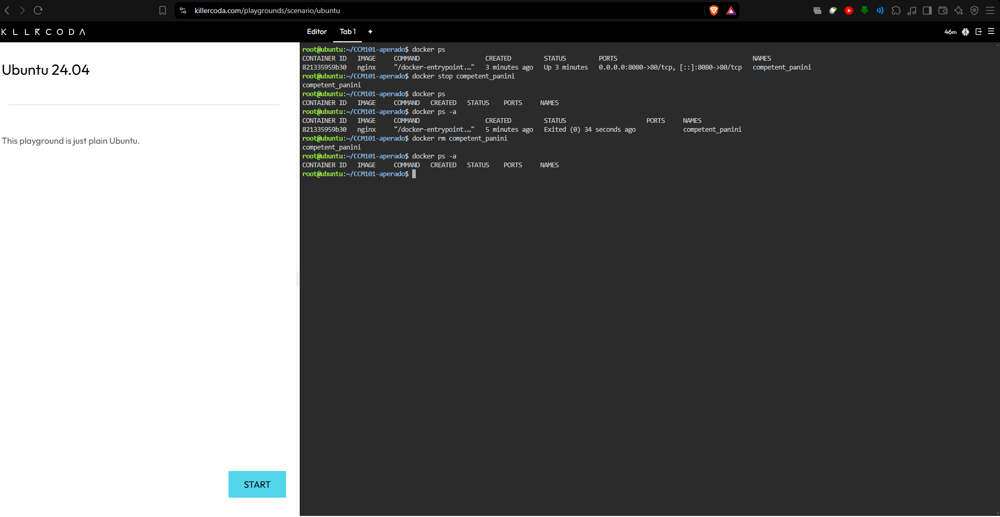
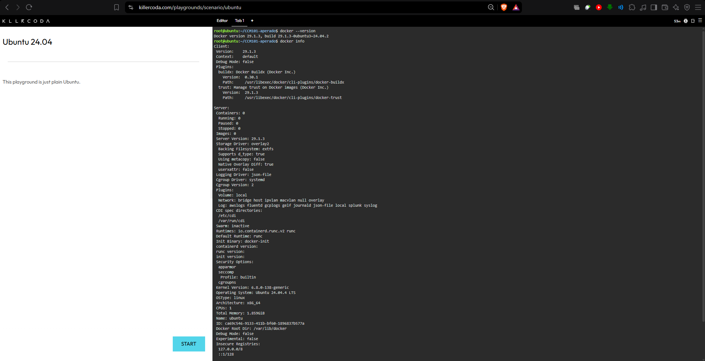
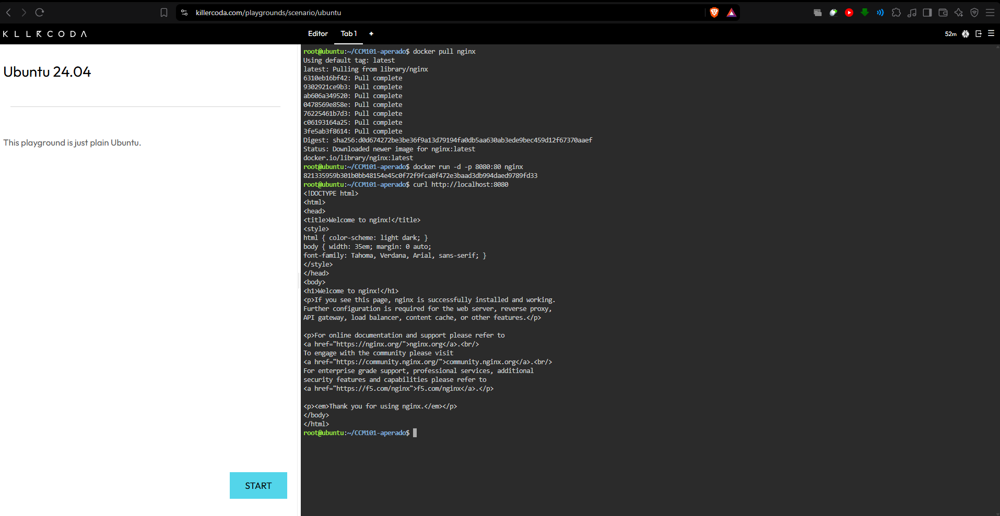
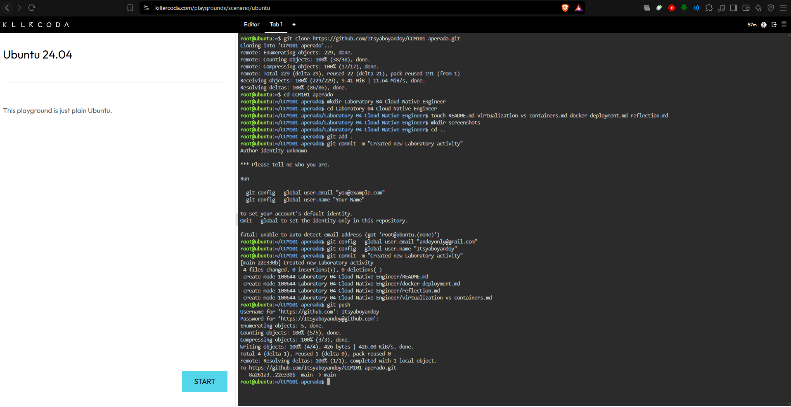

# ☁️ Mission 4: The Cloud-Native Engineer

## 📋 Mission Overview

Congratulations! After successfully guiding our clients through multi-cloud evaluations, you have been promoted to the Cloud-Native Engineering Team at CloudNova Technologies.

Modern cloud computing is no longer just about renting Virtual Machines (VMs) from AWS or Azure. Today's enterprise applications are built using lightweight, portable, and lightning-fast technologies called Containers.

Your new mission is to understand the shift from traditional virtualization to containerization.

Using the KillerCoda Playground, you will step into the shoes of a Cloud-Native Engineer. You will research the differences between VMs and containers, execute your very first Docker commands, and deploy a live, containerized web server in seconds.

Remember: A traditional system administrator manages servers, but a cloud-native engineer manages the services running on them.

## 🎯 Objectives

At the end of this laboratory activity, you should be able to:

* Differentiate between traditional Virtual Machines (VMs) and Containers.
* Access a Docker-enabled cloud environment using KillerCoda.
* Execute fundamental Docker CLI (Command Line Interface) commands.
* Pull, run, manage, and terminate a containerized application (Nginx).
* Create professional technical documentation of container operations using Markdown.
* Continue developing a well-organized GitHub Cloud Computing Portfolio.

## 🐳 Docker Commands Executed

The following table summarizes the Docker commands executed during the laboratory activity, including Docker environment verification, Nginx deployment, web server testing, and container lifecycle management.

| Command | What does this command do? |
|---|---|
| `docker version` | Displays detailed information about the installed Docker client and server versions. |
| `docker info` | Displays information about the Docker environment, including containers, images, storage, and system configuration. |
| `docker pull nginx` | Downloads the official Nginx image from Docker Hub so it can be used to create a container. |
| `docker run -d -p 8080:80 nginx` | Creates and starts an Nginx container in detached mode and maps host port `8080` to container port `80`. |
| `curl http://localhost:8080` | Sends an HTTP request to the Nginx web server through the mapped port to verify that the service is responding. |
| `docker ps` | Lists the currently running Docker containers and displays information such as the container ID, image, status, ports, and name. |
| `docker stop competent_panini` | Stops the running Nginx container named `competent_panini`. |
| `docker ps` | Checks the running containers to confirm that `competent_panini` is no longer active. |
| `docker ps -a` | Lists all containers, including stopped containers, to verify the stopped Nginx container and its `Exited (0)` status. |
| `docker rm competent_panini` | Removes the stopped `competent_panini` Nginx container from the Docker environment. |
| `docker ps -a` | Performs a final verification to confirm that the removed container no longer appears in the container list. |

---

## 🔄 Container Lifecycle

The Nginx container was managed through a complete Docker container lifecycle.

```text
Running
   ↓
docker stop competent_panini
   ↓
Stopped
   ↓
docker rm competent_panini
   ↓
Removed
```

The container was first identified using `docker ps`, stopped using `docker stop`, verified using `docker ps -a`, removed using `docker rm`, and finally checked again using `docker ps -a`.

### 📸 Container Lifecycle Evidence



---

## 🧠 Skills Learned

* Understanding the differences between Virtual Machines and Containers.
* Using the KillerCoda Playground as a Docker-enabled cloud environment.
* Executing fundamental Docker CLI commands.
* Verifying the Docker installation and environment.
* Pulling and running a containerized Nginx web server.
* Mapping a host port to a container port.
* Testing a containerized web server using `curl`.
* Listing and inspecting Docker containers.
* Stopping and removing a Docker container.
* Understanding the basic Docker container lifecycle.
* Creating clear and professional technical documentation using Markdown.
* Organizing and maintaining a GitHub Cloud Computing Portfolio.

---

## ⚠️ Challenges Encountered

One challenge encountered during the activity was becoming familiar with Docker CLI commands and understanding the purpose of each command in the container lifecycle. It was also important to identify the correct container name when managing the Nginx container.

During the activity, the Nginx container was automatically assigned the name `competent_panini`. Using the actual container name was necessary when executing the following commands:

```bash
docker stop competent_panini
```

and:

```bash
docker rm competent_panini
```

Another important learning experience was understanding the difference between a **running container**, a **stopped container**, and a **removed container**. The `docker ps` command was used to view running containers, while `docker ps -a` was used to view both running and stopped containers.

The activity became clearer after following the Docker lifecycle step by step: identifying the container, stopping it, verifying its status, removing it, and confirming that it was no longer present.

---

## 📸 Laboratory Evidence

The following screenshots provide evidence of the Docker activities completed during the laboratory.

### Docker Version



### Nginx Container Running



### Container Lifecycle


### Checkpoint 1



---

## ✅ Conclusion

This laboratory activity provided practical experience in transitioning from traditional virtualization concepts to container-based application deployment.

Through the KillerCoda Ubuntu 24.04 Playground, Docker commands were used to verify the Docker environment, obtain the Nginx image, deploy a containerized web server, map network ports, test the service, and manage the container lifecycle.

The activity demonstrated that containers provide an efficient and portable approach for packaging and running applications. Managing the Nginx container also provided hands-on experience with essential Docker operations, including `docker ps`, `docker stop`, `docker ps -a`, and `docker rm`.

Overall, Mission 4 strengthened my understanding of **Docker, containerization, Nginx deployment, port mapping, container lifecycle management, and cloud-native technologies**.
